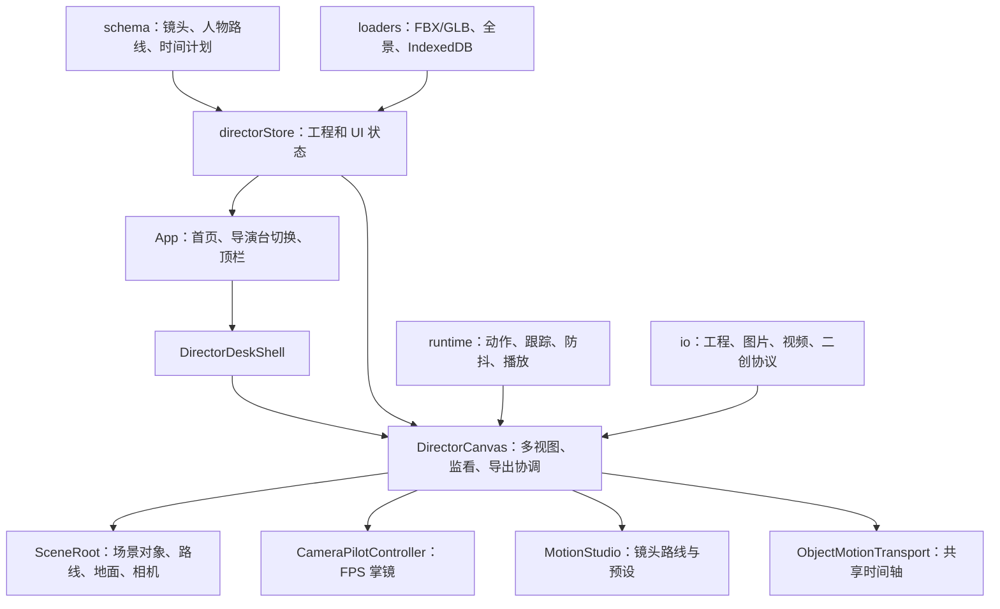

# 3D 导演台最新版完整交接文档

更新时间：2026-07-18

本文档是当前最新版 3D 导演台的产品、设计、技术、测试、发布和维护交接说明。目标不是只介绍怎么启动，而是让没有参与前期讨论的开发者能够理解产品为什么这样设计、核心功能如何协作、当前代码处于什么状态，以及下一步如何安全继续开发。

## 1. 项目身份

- 项目名称：3D 导演台
- 仓库：<https://github.com/xiaozangao/3d-director-desk>
- 在线体验：<https://xiaozangao.github.io/3d-director-desk/>
- 本地项目目录：`/Users/mm/Documents/3D导演台`
- 技术版本：`v0.3.0`
- 当前开发分支：`codex/mixamo-wasd-audit`
- 正式发布分支：`origin/main`
- 当前状态：本文档对应 `v0.3.0` 开源发布基线；准确提交号以仓库 `main` 分支历史为准
- 开源协议：MIT，第三方素材仍需分别遵守各自来源许可

## 2. 最重要的接手和恢复注意事项

`v0.3.0` 发布前曾包含大量集中开发改动，且本机仍保留发布前完整副本。接手或恢复时必须遵守以下规则：

1. 不要执行 `git reset --hard`。
2. 不要执行会覆盖文件的 `git checkout -- .` 或 `git restore .`。
3. 正常接手以 `origin/main` 的 `v0.3.0` 发布提交为准；需要追查发布前状态时再读取本地副本。
4. 不要在存在未提交改动时删除未跟踪文件，它们可能包含检查点文档、测试页面和新模块。
5. 发布前先完整备份当前目录，再提交和推送。
6. 发布前必须运行 `npm test`、`npm run build` 和 `git diff --check`。

已有两个开发前副本：

- `/Users/mm/Documents/3D导演台-backups/20260713-before-camera-templates`
- `/Users/mm/Documents/3D导演台-backups/20260715-before-v03-development`

本次发布前完整副本：

- `/Users/mm/Documents/3D导演台-backups/20260718-before-release`
- 大小约 85 MB，包含当前 Git 元数据、源码、文档和本地素材；排除了 `node_modules`、`dist`、研究缓存和视频构建产物。

旧副本只能复制到新目录中恢复，不能覆盖当前项目目录。

## 3. 项目要解决的问题

这个项目不是要在浏览器里复制完整 Blender，也不是要替代专业三维软件。它要解决的是 AI 视频和传统分镜之间缺少稳定中间层的问题。

自然语言描述“从过肩镜头绕到人物正脸”时，视频模型可能每次理解都不同。3D 导演台通过明确的空间位置、镜头轨迹、人物路线、时间、FOV 和跟踪目标，把模糊的镜头语言转换成可重复的三维预演结果，再导出参考视频供后续 AI 视频、剪辑或其他工具使用。

产品定位可以概括为：

> 一个让普通用户像玩 FPS 游戏一样，在浏览器中摆场景、走镜头、安排人物运动并导出稳定参考视频的轻量 3D 预演导演台。

## 4. 核心设计理念

### 4.1 小白优先，而不是专业术语优先

- 用户不需要先理解 Blender 的相机对象、约束器、曲线编辑器和复杂时间轴。
- 进入掌镜模式后使用 `WASD` 移动、鼠标转向、`Enter` 保存镜头。
- 路线点直接用编号和圆圈显示，播放到哪个点就高亮哪个点。
- 常用二元设置使用开关或分段按钮，例如平滑/折线、匀速/柔和、防抖开/关。
- 复杂参数保留，但默认值必须先让用户得到可用结果。

### 4.2 轨迹点是第一等对象

最初版本要求先放置机位，再编辑运镜，使用门槛过高。现在的核心流程是直接生成轨迹点：

- 镜头点可添加、插入、删除、排序、移动和批量移动。
- 人物路线点使用同一套思路。
- 每个镜头点保存位置、朝向/FOV、跟踪主体、身体部位、跟随方式和防抖状态。
- 路线本身可以是平滑曲线或折线。

### 4.3 镜头和人物必须共享时间

镜头不是独立运动。人物、道具和镜头都使用同一个标准化时间进度 `0..1`，再由当前镜头的总时长换算成秒。

因此可以实现：

- 人物先走，镜头跟着人物定镜头。
- 掌镜时按空格暂停或继续人物运动。
- 看路线、看成片、监看小窗和导出使用同一时刻。
- 底部镜头轨和人物轨可以共同显示移动段与停留段。

### 4.4 手动可控优先，AI 接口后置

项目保留给本地 LLM、ComfyUI 或其他下游二创的接口，但主程序不内置特定 AI 工作流。

原因：

- 手动三维空间是稳定基准。
- 不同用户使用的 LLM 和视频工作流不同。
- 自然语言可以生成配置，但最终配置仍应落到明确的数据模型。
- 主程序保持轻量、可离线、可验证，二创工具通过协议读取结果。

### 4.5 本地优先和隐私优先

- 工程默认只保存在当前浏览器。
- 大型本地模型和动画保存在 IndexedDB。
- 不需要后端账号，不自动上传素材。
- 插件只能通过受限协议读取工程和回传 JSON 结果，不能在导演台中任意执行代码。

### 4.6 社区共创

群友真实工作流是功能优先级的重要来源。当前群友预设贡献信息：

- 名称：AIGC 耀光
- 抖音号：AIJPDM001
- 贡献：群友镜头预设构想与共创反馈

代码中的群友预设会展示贡献者、适用场景、版本和许可说明。后续新增贡献者时应保留来源和身份证据，不要凭空填写。

## 5. 目标用户与典型工作流

### 5.1 AI 视频创作者

1. 摆放人物、车辆、家具和场景物体。
2. 设置人物行走、跑步、停留或动作。
3. 用掌镜模式走出镜头路线。
4. 让不同镜头点跟踪不同人物或身体部位。
5. 预览后导出 MP4，作为视频生成模型的参考视频。

### 5.2 分镜和预演用户

1. 建立多个独立导演台，对应不同镜头或场景。
2. 使用导演视角检查空间关系和运动路线。
3. 使用第一视角检查最终构图、FOV 和节奏。
4. 导出工程 JSON、当前帧、首尾帧或参考视频。

### 5.3 二创开发者

1. 通过 iframe 嵌入导演台。
2. 使用 `instanceId` 隔离工程。
3. 通过版本化 `postMessage` 协议读取工程和时间轴。
4. 请求帧或视频导出。
5. 把 LLM、ComfyUI 或其他工具结果作为受限插件结果回传。

## 6. 当前主要功能

### 6.1 首页和多导演台

- 首页列出多个独立导演台。
- 支持创建、选择和删除导演台。
- URL 中的 `instanceId` 决定当前导演台。
- 首页包含四步上手、完整快捷键、macOS 触控板操作、更新说明和群友贡献。
- 顶部显示当前应用版本。

### 6.2 场景编辑

- 添加人物、基础几何体、机位和生活模型。
- 对象支持位置、旋转、缩放、统一缩放、锁定、隐藏和改色。
- XYZ 控件只保留三轴箭头，避免三个平面手柄误操作。
- 支持复制、粘贴和撤销。
- 连续拖动作为一次撤销记录处理。

### 6.3 导演视角和第一视角

- 导演视角用于摆场景、检查镜头路线和人物路线。
- 第一视角用于查看最终成片构图。
- 普通导演视角支持 `WASD`、鼠标和触控板操作。
- 看成片时可以暂停和拖动时间轴，不退出第一视角。

### 6.4 掌镜模式

- `WASD`：前后左右移动。
- `E / Q`：上升和下降。
- 鼠标：转动视角。
- `Enter`：连续保存轨迹点，编辑轨迹点时更新当前点。
- `Space`：播放或暂停人物与物体运动。
- `F`：锁定准星指向的人物、物体或空间点。
- `Esc`：释放鼠标并退出掌镜。
- 滚轮：调整镜头 FOV。

鼠标使用 Pointer Lock，正常情况下进入掌镜后光标消失，按 `Esc` 后恢复。

### 6.5 镜头路线

- 无需先摆放实体机位即可创建虚拟镜头。
- 支持添加、插入、删除、排序和批量移动轨迹点。
- 支持选择任意多个点整体移动。
- 支持平滑曲线和折线。
- 支持匀速、柔和和自定义速度节奏。
- 中间点可设置经过或停留，并输入停留秒数。
- 当前点、即将到达点和已经经过点有不同高亮状态。
- 镜头跟随白线在对象运动时实时更新。

### 6.6 镜头预设

基础预设 8 个：

- 推镜
- 拉镜
- 左摇镜
- 右摇镜
- 俯仰抬镜
- 俯拍压镜
- 左移镜
- 右移镜

群友预设 10 个：

- 环绕摇臂升镜
- 跟拍
- 平行跟拍
- 手持晃镜
- 过肩绕正面
- 近景半环绕
- 环绕摇臂降镜
- 低机位追拍
- 俯视跟拍
- 横移揭示

预设支持：

- 选择跟踪主体。
- `50%..300%` 实时调整轨迹范围。
- 群友预设按主体中心整体缩放，所有预设都会明显响应范围变化。
- 生成后仍是普通可编辑轨迹点，不是不可修改的黑盒动画。

### 6.7 跟踪和防抖

每个镜头轨迹点可以独立设置：

- 不跟踪，使用固定朝向。
- 跟踪人物或物体。
- 跟踪人物整体、头、胸、腰和四肢等 16 个语义部位。
- 立即响应或柔和响应。
- 保留身体动作抖动或开启防抖。

另外提供整条镜头路线的“全部开启/全部关闭”防抖按钮，之后仍可对单个点覆盖。

防抖运行时位于 `src/editor/runtime/cameraBodyTracking.ts`。主视口、监看小窗、看成片和视频导出必须统一调用同一个运行时快照，不能在不同视图单独实现。

### 6.8 人物和物体路线

- 人物路线点可添加、插入、删除和拖动。
- 每个路线点使用常亮双层圆圈和编号。
- 路线支持平滑和折线。
- 人物可以沿路线边走边转向，不需要停下转完再走。
- 每段可选择自动行走、行走、跑步、蹲起、跨步、跳跃或挥手。
- 路线点支持经过或停留。
- 停留时可保持当前动作、站立或播放指定动作。
- 人物路线开关与选中状态分离，点击空白处不会让路线消失。
- 道具也可以使用对象运动关键点记录位置、旋转和缩放。

### 6.9 统一时间轴

- 当前时间使用大号粗体黑色数字显示。
- 主进度条、镜头轨和人物轨共享同一个进度。
- 镜头轨和人物轨都可以直接拖动定位。
- 拖动时自动暂停，不会回到起点。
- 轨道区分移动段、停留段和当前时间线。
- 播放到人物或镜头点时，相应编号会高亮。
- 总时长范围为 `0.5..30` 秒。

### 6.10 实时监看和 FOV

- 看路线时，小窗显示最终成片。
- 看成片时，小窗显示导演视角路线。
- 拖动底部进度条时，小窗实时显示当前第一视角构图。
- 主成片 FOV 和小窗 FOV 分开保存。
- 导出使用主成片 FOV，不使用小窗 FOV。

### 6.11 地面、网格和碰撞

- 地面材质：摄影棚、混凝土、柏油、木地板、草地。
- 用户可输入地面纹理大小，范围 `0.25..8`，数值越大图案越大。
- 地面亮度、透明度和高度可调。
- 编辑网格、移动吸附、显示地面和路线防穿模互相独立。
- 防穿模开启时，人物贴地，人物路线和镜头路线受地面和场景包围盒约束。
- 防穿模关闭时允许穿墙或制作特殊镜头。

### 6.12 全景图

- 导入环境全景图。
- 支持等距柱状和背景板模式。
- 支持亮度、水平旋转、删除和持久化。
- 大图片二进制保存到 IndexedDB，工程只保存稳定引用。
- 导演视角、第一视角、监看和导出使用一致环境。

### 6.13 人物模型、姿势和动作

- 内置 UE4 风格人偶。
- 支持多种身体比例：普通、女性、宽体、肌肉、纤细、青年、儿童和 Q 版。
- 内置 20 套静态姿势。
- 内置行走、跑步、蹲起、左跨步、跳跃和挥手等动作语义。
- 支持 Mixamo、RobotExpressive、Soldier 等本地兼容素材。
- 主视口、小窗、看成片、暂停、拖动和重播使用同一动作时间采样。

### 6.14 外部绑骨人物和动作导入

- 人物模型支持 FBX 和 GLB。
- 动作文件支持 FBX 和 GLB。
- 模型和动作可以分离导入。
- 导入前进行 SkinnedMesh、骨架、骨骼数量、动画和身体部位覆盖体检。
- 自动识别 Mixamo、mixamorig1、Bip/UE4、CC Base 和通用人形。
- 自动估算朝向、身高、缩放和落地偏移。
- 未自动识别时可手动映射 15 个主要骨骼。
- 手动映射同时用于动作重定向和身体部位跟拍。
- 大型文件保存到 IndexedDB，刷新后仍可恢复。

`public/local-assets/` 同时承载开源版内置素材和开发者本机可选素材。`v0.3.0` 按项目所有者明确要求发布 Mixamo 兼容人物与动作，以及模型库使用的完整 GUO 人物、动物和道具包；`sample-characters/` 等个人导入测试素材仍由 Git 忽略。代码仍须在素材缺失时安全隐藏相应分类，方便二创者制作轻量分支。

### 6.15 模型改色

- 内置人物、动物、车辆和道具支持改色。
- 导入模型会先克隆并隔离材质，避免修改一个对象时影响同源其他对象。
- 多材质模型会在保留纹理的前提下应用颜色。

### 6.16 视频和图片导出

- 当前帧 PNG。
- 首帧 PNG。
- 尾帧 PNG。
- 当前、四方位和十二方位截图。
- 720p / 1080p 参考视频。
- 24 / 30 / 60 FPS。
- 文件扩展名统一为 `.mp4`。
- 使用浏览器支持的 H.264 MP4 MediaRecorder 类型。

如果浏览器不支持 MP4 MediaRecorder，会明确提示使用最新版 Chrome 或 Edge。导出时隐藏路线、点、标签和操作界面，并在结束后恢复原播放进度和暂停状态。

### 6.17 性能档位和基准

用户可选：

- 自动
- 流畅
- 高清

内部仍保留均衡配置用于自动档和基准对比。性能档位统一影响：

- 主画面 DPR。
- 监看小窗 DPR。
- 控件画布 DPR。
- 抗锯齿。
- `preserveDrawingBuffer`。
- 播放期间 UI 同步频率。

基准场景包括轻量、中等和重型三种规模，可导出匿名报告。macOS 已验证，Windows 真机数据仍需群友补充。

### 6.18 二创接口

协议版本：`1`。

主要 action：

- `capabilities.get`
- `project.get`
- `timeline.get`
- `export.frame`
- `export.video`
- `plugin.result.submit`
- `plugin.results.list`

安全边界：

- 校验 `event.origin` 和父窗口来源。
- 使用 `hostOrigin` 限定宿主。
- 工程读取返回 JSON 快照。
- 插件结果最大 512 KB，最多保留 50 条。
- 插件结果绑定工程指纹，工程变化后标记为过期。
- 不接受任意脚本或远程代码执行。

完整格式见 `docs/embed-contract.md`，宿主示例见 `examples/infinite-canvas-embed.tsx`。

### 6.19 高斯泼溅实验

高斯功能保持独立实验，不进入主编辑器首屏：

- 支持 PLY、SPLAT、KSPLAT 等格式实验。
- 支持与人物、道具和摄像机混合显示。
- 支持表面取点、向下地面采样和代理碰撞。
- 250K 和 1M 点场景已有 macOS 性能数据。
- Spark 实验包约 4.97 MB，包体偏重。

在 Windows 真机、真实扫描场景和视频导出通过前，不要把它并入主编辑器依赖。

## 7. 技术栈

| 层 | 技术 |
| --- | --- |
| 前端框架 | React 18 |
| 构建工具 | Vite 6 |
| 语言 | TypeScript 5.7 |
| 3D 引擎 | Three.js 0.184 |
| React 3D | `@react-three/fiber` |
| 3D 控件 | `@react-three/drei`、`camera-controls` |
| 状态管理 | Zustand 5 |
| 图标 | Lucide React |
| 测试 | Vitest、Testing Library、jsdom |
| 高斯实验 | Spark |
| 部署 | GitHub Pages + GitHub Actions |

运行要求：Node.js 20 或更高版本。

## 8. 总体架构



## 9. 主要目录职责

### `src/App.tsx`

- 首页。
- 多导演台切换。
- 顶部导航。
- 全局复制、粘贴和撤销快捷键。
- 性能基准模式入口。
- 宿主初始化。

### `src/editor/canvas/`

- `DirectorCanvas.tsx`：主视口、监看视口、相机同步、帧导出和 MP4 导出。
- `SceneRoot.tsx`：场景对象、人物路线、镜头路线、地面、碰撞和多种渲染模式。
- `DirectorKeyboardController.tsx`：普通视角 WASD。
- `ViewportToolbar.tsx`：视口工具栏、模型库、导入和显示开关。
- `groundMaterialPresets.ts`：地面程序纹理与物理尺寸重复逻辑。

### `src/editor/motion/`

- `MotionStudio.tsx`：运镜工作台、镜头点、预设、跟踪、防抖、导出入口。
- `CameraPilotController.tsx`：掌镜移动、Pointer Lock、F 锁定和 Enter 记录。
- `ObjectMotionTransport.tsx`：底部共享时间轴和双轨显示。
- `cameraPathTemplates.ts`：基础和群友镜头预设生成公式。
- `cameraMotionPresets.ts`：时长、轨迹和速度参数预设。
- `RouteCustomEasingControl.tsx`：自定义段内节奏。

### `src/editor/schema/`

- `directorProject.ts`：工程主数据结构。
- `cameraMotion.ts`：镜头路径标准化、采样和到达时间。
- `objectMotion.ts`：人物/道具路径、动作段和速度采样。
- `routeTiming.ts`：人物和镜头共用的距离、停留和曲线时间计划。
- `cameraTarget.ts`：逐点目标、身体部位和目标混合。
- `cameraPlayback.ts`：最终镜头播放快照。
- `semanticBody.ts`：语义身体部位和骨骼映射类型。

### `src/editor/runtime/`

- `CharacterModel.tsx`：按角色类型选择 UE4、Mixamo 或程序人偶。
- `MixamoCharacterModel.tsx`：动作选择、重定向、重复采样和根运动处理。
- `cameraBodyTracking.ts`：动态身体部位跟踪与防抖。
- `semanticBodyTracking.ts`：从真实场景骨骼查找语义部位。
- `playbackRuntime.ts`：高频运行时播放进度，减少整棵 React 树重渲染。
- `modelMaterialTint.ts`：导入模型材质隔离和改色。

### `src/editor/panels/`

- 场景、人物、道具、摄影机右侧属性面板。
- `CharacterPanel.tsx` 包含人物路线、动作和手动骨骼映射入口。
- `ScenePanel.tsx` 包含全景、地面、网格和碰撞设置。
- `InspectorControls.tsx` 是通用数字、滑杆、颜色、XYZ 和选择控件。

### `src/editor/loaders/`

- 本地模型导入。
- 人物模型体检。
- 动作文件体检。
- 导入预览和骨架识别。
- 全景图处理。
- IndexedDB 二进制存储。

### `src/editor/io/`

- 工程 JSON 导入导出。
- 工程版本迁移和指纹。
- MP4 参考视频导出接口。
- 干净帧导出。
- iframe 宿主桥。
- 二创协议和插件结果注册表。

### `src/editor/performance/`

- 性能档位。
- 自动档判断。
- 基准场景。
- FPS 和 1% Low 采样。
- 匿名报告生成。

## 10. 核心数据模型

工程顶层 `DirectorProject`：

```ts
interface DirectorProject {
  version: 1;
  scene: SceneSettings;
  assets: DirectorAssetRef[];
  animationAssets?: DirectorAnimationAssetRef[];
  objects: DirectorObject[];
  cameras: DirectorCameraShot[];
  activeCameraId: string | null;
  panoramaAssetId: string | null;
}
```

### 10.1 镜头轨迹点

每个镜头点保存：

- `time`
- `position`
- `target`
- `fov`
- `targetMode`
- `targetObjectId`
- `targetBodyPart`
- `targetFollowMode`
- `targetStabilizationEnabled`
- `pointBehavior`
- `holdSeconds`

### 10.2 人物和物体轨迹点

每个点保存：

- `time`
- 完整 `transform`
- 本段 `actionPresetId`
- `facingMode`
- `pointBehavior`
- `holdSeconds`
- `holdAction`
- `holdActionPresetId`

### 10.3 场景设置

主要字段：

- 场景缩放、位置和旋转。
- 背景颜色和亮度。
- 全景旋转和半径。
- 标签、网格、吸附和地面开关。
- 地面材质、颜色、纹理大小、亮度、透明度和高度。
- 路径碰撞开关。

## 11. 播放和时间计算

### 11.1 标准化进度

全局播放状态使用 `cameraMotionProgress`，范围 `0..1`。秒数为：

```text
currentSeconds = progress * activeCamera.motionPath.duration
```

人物和道具没有独立总时长，使用当前活动镜头时长，因此镜头和表演天然同步。

### 11.2 时间计划

`routeTiming.ts` 根据以下信息计算真实到达和离开时间：

- 轨迹点空间距离。
- 平滑或折线路径的采样长度。
- 匀速、柔和或自定义节奏。
- 每个点的停留秒数。

不要直接用原始 `keyframe.time` 判断 UI 高亮；自动速度模式必须使用 timing plan 的 `arrivals` 和 `departures`。

### 11.3 高频播放

播放帧进度同时写入 `playbackRuntime.ts`，3D 场景可直接订阅运行时进度，避免每一帧都让完整 React UI 重渲染。低频 UI 仍从 Zustand 状态读取。

## 12. 跟踪和防抖链路

完整链路：

1. `cameraTarget.ts` 根据当前镜头段确定前后两个轨迹点的目标。
2. 人物目标通过 `semanticBodyTracking.ts` 获取动作采样后的真实骨骼世界坐标。
3. 前后轨迹点目标根据当前段进度混合。
4. `cameraPlayback.ts` 生成镜头位置、目标和 FOV。
5. `cameraBodyTracking.ts` 根据立即/柔和和防抖状态进行时间滤波。
6. 主视口、小窗、第一视角和导出共同消费最终快照。

防抖开启时响应系数低于普通柔和跟随，用于过滤走路和肢体动作造成的高频晃动。时间轴倒拖、大幅跳转或切换镜头时会重置缓存，避免残影。

## 13. 数据保存

### 13.1 localStorage

导演台列表：

- `standalone-3d-director-desk-registry-v1`
- `standalone-3d-director-desk-active-id-v1`

工程数据：

- `storyai-3d-director-desk-demo`
- `storyai-3d-director-desk-demo:<instanceId>`

本地模型库元数据：

- `storyai-3d-director-local-model-library`

### 13.2 IndexedDB

- 数据库：`storyai-3d-director-assets`
- 对象仓库：`binary-assets`
- 稳定 URL 前缀：`director-asset://local/`

本地模型、动作和大型全景图使用 IndexedDB。工程 JSON 只保存引用，不直接塞入大块 base64。

### 13.3 地址隔离

本地 `http://127.0.0.1` 和线上 GitHub Pages 是不同 origin，浏览器数据不会自动同步。换浏览器、清理网站数据或使用无痕模式也会失去本地工程。

重要工程必须导出工程 JSON。

## 14. 工程文件版本

- 文档格式：`3d-director-desk-project`
- schema 版本：`1`
- 旧裸工程按版本 `0` 迁移到 `1`
- 非整数、负数和未来版本会明确拒绝
- 工程指纹使用 FNV-1a 32 位摘要

新增数据字段时必须：

1. 在 schema 中定义。
2. 在 normalizer 中提供旧工程默认值。
3. 更新工程导入导出测试。
4. 更新二创协议快照测试。
5. 确认线上旧工程不会因为缺字段黑屏。

## 15. 撤销设计

- 普通离散操作直接记录快照。
- 滑杆、XYZ 拖动和连续交互使用 `beginUndoBatch` / `endUndoBatch`。
- 一次完整拖动只产生一个撤销步骤。
- 播放进度和临时预览不应污染撤销栈。
- 导入体检中的临时动作测试不写入正式工程。

## 16. 测试和验证基线

截至 2026-07-18：

- 测试文件：124 个测试套件。
- 自动化测试：680 项。
- 通过：680。
- 失败：0。
- `npm run build`：通过。
- `git diff --check`：通过。
- 构建只有既有的大 chunk 警告。

常用命令：

```bash
npm test
npm run build
git diff --check
```

聚焦测试示例：

```bash
npm test -- --run src/editor/motion/MotionStudio.test.tsx
npm test -- --run src/editor/runtime/cameraBodyTracking.test.ts
npm test -- --run src/editor/canvas/SceneRoot.test.tsx
```

对于真实 3D 行为，不能只依赖 DOM 单测。高风险功能还应验证：

- 画布非黑。
- 首尾帧有变化。
- 主画面和小窗一致。
- 暂停、倒拖和重播一致。
- 导出后进度恢复。
- 控制台没有业务错误。

## 17. 本地运行

安装依赖：

```bash
npm install
```

开发模式：

```bash
npm run dev -- --host 127.0.0.1 --port 5173
```

生产构建：

```bash
npm run build
```

预览构建：

```bash
npm run preview
```

如果端口已占用，换一个端口，不要结束无法确认归属的用户进程。

## 18. 发布和推送流程

当前 GitHub Pages 工作流位于 `.github/workflows/pages.yml`。推送到 `main` 后会自动：

1. 使用 Node.js 20。
2. 执行 `npm ci`。
3. 执行 `npm test`。
4. 执行 `npm run build`。
5. 上传 `dist`。
6. 部署 GitHub Pages。

本次最新版发布建议流程：

```bash
cd /Users/mm/Documents/3D导演台

# 1. 再做一份目录级备份
# 2. 检查差异和敏感文件
git status --short
git diff --check

# 3. 验证
npm test
npm run build

# 4. 只添加应发布文件
git add <确认后的文件>

# 5. 检查暂存内容
git diff --cached --stat
git diff --cached

# 6. 提交和推送必须得到项目所有者明确确认
git commit -m "feat: release latest 3d director desk update"
git push origin HEAD:main
```

发布前必须排除：

- `node_modules/`
- `dist/`
- `.env` 和密钥
- `.research-video/`
- `.video-build/`
- `.firecrawl/`
- 浏览器本地工程
- 私人素材
- `public/local-assets/` 中不属于本次内置模型库的个人测试素材
- 临时截图和 smoke 页面，除非明确要作为项目证据发布

本次发布文件边界：

- 发布源代码、测试、README、二创协议、正式里程碑文档和 `PROJECT-HANDOFF.md`。
- 发布 `public/local-assets/mixamo/` 中的兼容人物、动作和来源说明。
- 发布模型库依赖的完整 `public/local-assets/guo-3d-assets/` 人物、动物和道具包，避免线上出现只有卡片、没有模型文件的情况。
- 不发布 `public/local-assets/sample-characters/` 等个人导入测试素材。
- 不发布 `.firecrawl/`、`.research-video/`、`.video-build/`、`成片/` 和本地视频制作素材。
- 根目录 smoke HTML、验证截图和基准图片逐项判断，不使用 `git add .` 一次性加入。

2026-07-18 发布前验证：

- 专项测试：3 个测试文件、40 项通过。
- 全仓测试：124 个测试套件、680 项通过，0 失败。
- 生产构建：通过，仅保留高斯实验大 chunk 的既有警告。
- `git diff --check`：通过。
- 浏览器：首页显示 `AIGC 耀光 / AIJPDM001`，群友预设显示 10 个；“跟拍”详情中的贡献者、抖音号和许可正确。
- 首页无横向溢出，浏览器控制台无业务错误。
- 正式发布版本：`v0.3.0`；提交号和 GitHub Pages 部署状态以仓库 Actions 与 `main` 分支为准。

## 19. 当前已知边界

### 19.1 Windows 真机

性能档位和匿名基准已经完成，但 Windows 真机数据仍需真实用户补充。不要伪造 Windows FPS 或最低配置结论。

### 19.2 外部人物兼容

Mixamo、mixamorig1、RobotExpressive、Soldier 和本地 GUO 测试覆盖较多，但未知 DCC、特殊骨架和非人形模型仍可能需要手动映射或专用运行时。

### 19.3 碰撞精度

当前是轻量包围盒约束，适合预演，不是完整刚体物理。复杂凹形模型可能保留安全间距。

### 19.4 MP4 浏览器支持

依赖浏览器 H.264 MediaRecorder。最新版 Chrome/Edge 是首选；不支持时必须给出明确提示，不能伪装导出成功。

### 19.5 本地素材与开源仓库

本机可安装额外人物、动作和 GUO 模型，但公开仓库必须遵守素材许可和体积边界。缺少本地包时应用应自动降级，不应黑屏。

### 19.6 高斯泼溅

目前是实验入口，不应直接并入主应用启动包。

## 20. 明确暂缓的构想

以下功能目前不是发布阻塞项：

- 内置 ComfyUI 连接。
- 内置某个本地 LLM。
- 自然语言直接生成镜头。
- FPV、RC 遥控器或实体手柄。
- 高斯泼溅正式并入主编辑器。

正确方向是保留稳定数据和接口，让二创开发者自行接入。

## 21. 接手后的第一小时

1. 阅读本文档、`../README.md` 和 `DEVELOPMENT-ROADMAP.md`。
2. 执行 `git status --short --branch`，确认大量本地改动仍存在。
3. 不修改文件，先执行 `npm test` 和 `npm run build`。
4. 启动新端口并打开一个独立 `instanceId`。
5. 创建人物路线、镜头预设和身体部位跟拍，确认基础流程。
6. 导出一段短 MP4，确认浏览器支持。
7. 阅读 `directorStore.ts`、`DirectorCanvas.tsx`、`SceneRoot.tsx` 和 `MotionStudio.tsx`。

## 22. 新功能开发检查表

每个功能至少回答以下问题：

- 它保存在哪个 schema 字段？
- 旧工程缺少字段时默认值是什么？
- 主视口、小窗、第一视角和导出是否共用结果？
- 暂停、拖动、倒拖和重播是否一致？
- 是否需要撤销批处理？
- 是否会让 UI 面板变宽或遮挡画面？
- Windows 低性能档是否仍可用？
- 本地素材缺失时是否安全降级？
- 二创协议是否需要增加能力声明？
- 是否有自动测试、构建和浏览器证据？

## 23. 维护优先级建议

发布后优先顺序：

1. 收集 Windows 真机问题和匿名性能报告。
2. 收集未知 FBX/GLB 人物导入失败样本。
3. 修复真实用户可复现的动作、路线、导出和黑屏问题。
4. 继续压缩 UI 占用空间，避免增加新的常驻面板。
5. 完善贡献榜和群友预设来源。
6. 再考虑自然语言、ComfyUI 或高斯正式集成。

## 24. 开发纪律

- 先复现，再修改。
- 一次只改变一个关键变量。
- 优先复用现有 schema、Store action 和运行时。
- 不为单个视图复制第二套播放逻辑。
- 不把测试页面逻辑反向依赖到主应用。
- 不回退无法确认来源的用户改动。
- 不在未测试时提交或推送。
- 文档、代码和线上说明必须与实际运行一致。

## 25. 相关文档索引

- `../README.md`：面向普通用户和开源访问者。
- `DEVELOPMENT-ROADMAP.md`：10 个开发目标和完成状态。
- `docs/embed-contract.md`：二创协议完整说明。
- `milestones/MILESTONE-*.md`：各阶段实现与验证证据。
- `milestones/MILESTONE-BACKUP-RESTORE-AUDIT.md`：本地副本和恢复演练。
- `milestones/MILESTONE-FULL-AUDIT-20260716.md`：严格审计记录。
- `public/local-assets/mixamo/SOURCES.md`：本地兼容动作和模型来源记录。
- `UPSTREAM.md`：上游项目和改造来源。

## 26. 当前结论

当前 3D 导演台已经从早期的单一镜头演示，发展为可编辑人物路线、镜头路线、动作、身体部位跟踪、防抖、实时监看、MP4 导出、外部绑骨人物导入、性能档位和二创接口组成的完整浏览器预演工具。

核心产品路线已经成型。下一阶段不应继续无边界堆功能，而应以发布、真实用户回归、Windows 兼容、外部人物样本和稳定性为主。

任何接手者都应先保护当前未提交工作树，再开始发布或后续开发。
