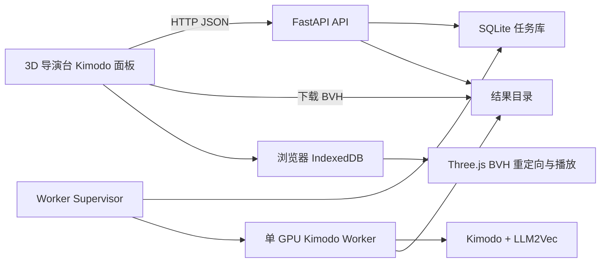

# Kimodo 本地生成服务设计

## 目标

为 3D 导演台增加可选的本地 Kimodo 动作生成能力。用户可以为当前选中的角色提交提示词，观察排队和生成进度，在页面刷新或服务重启后恢复任务，并把成功结果保存为导演台动作资产。

首版只面向单机、单用户、单 NVIDIA GPU。前端仍可单独部署为静态站点；Kimodo 服务不可用时，现有编辑、导入、播放和导出能力不受影响。

## 非目标

- 公网账号、登录、租户隔离和按用户配额。
- 多 GPU 调度、Kubernetes、Redis 或外部消息队列。
- 在浏览器中运行 Kimodo 模型。
- 修改 Kimodo 模型或训练新的角色骨架。
- 将模型权重、Hugging Face token 或生成结果提交到 Git。

## 功能需求

1. 创建、查询、取消、重试和清理动作生成任务。
2. 持久保存任务状态、请求参数、重试次数和错误摘要。
3. 单个 GPU worker 串行生成，避免并发占满显存。
4. worker 崩溃、CUDA OOM 或服务重启后恢复未完成任务。
5. 以稳定阶段报告进度：排队、加载、生成、后处理、导出、完成。
6. 生成结果以标准 T-pose SOMA BVH 下载。
7. 导演台将 BVH 保存到 IndexedDB，注册为动作资产并应用到当前角色。
8. 保留垂直根运动，移除水平根运动；角色水平位置仍由导演台路线控制。
9. 提供 Docker Compose、本机数据卷、健康检查和诊断日志。

## 非功能需求

- 任务创建和查询在模型空闲时应于 500ms 内响应。
- SQLite 和结果目录必须使用持久化卷；服务重启不能丢失已完成任务。
- 同一时刻最多运行一个 GPU 任务。
- 所有状态转移必须可重放，并记录 `createdAt`、`updatedAt`、`attempts` 和错误代码。
- 输出文件使用临时文件生成并原子改名，API 不提供半成品。
- 默认只监听 `127.0.0.1`；跨源仅允许明确配置的导演台地址。
- 日志不得输出 Hugging Face token、完整环境变量或动作二进制。

## 高层架构



API 和 supervisor 运行在同一个容器中，GPU worker 是受监管的子进程。进程隔离让 API 在 CUDA 上下文损坏时继续响应，也允许取消任务时终止并重新加载 worker。SQLite 是队列的事实来源，不依赖内存队列保证恢复。

## 任务状态机

```text
queued -> loading -> generating -> postprocessing -> exporting -> succeeded
   |         |           |              |               |
   +---------+-----------+--------------+---------------+-> failed
   +-------------------------------------------------------> canceled

failed --retry--> queued
stale running lease --startup recovery--> queued | failed
```

任务拥有递增的 `attempts`、可配置的 `maxAttempts`、worker 租约和心跳。worker 领取任务时使用 SQLite 条件更新，确保只有一个任务被占有。启动恢复会把过期的运行态任务重新排队；达到最大次数则标记失败。取消排队任务立即生效；取消运行任务会终止 worker，标记任务取消，再启动干净 worker。

Kimodo 暂无稳定的逐扩散步回调，因此进度值表示真实阶段，不伪造模型内部百分比。首版阶段建议值为 0、10、20、80、95、100。

## API 契约

基础路径为 `/api/v1`：

- `POST /jobs`：校验提示词、时长、模型、seed 和样本数，写入队列。
- `GET /jobs?limit=50`：按创建时间倒序返回历史任务。
- `GET /jobs/{id}`：返回当前状态和结果元数据。
- `POST /jobs/{id}/cancel`：请求取消。
- `POST /jobs/{id}/retry`：从失败或取消状态创建新尝试。
- `DELETE /jobs/{id}`：仅删除终态任务和对应结果。
- `GET /jobs/{id}/result`：成功后下载 BVH。
- `GET /health`：报告 API、数据库、worker 和 Kimodo 可用性。

错误使用稳定代码，例如 `invalid_request`、`model_unavailable`、`gpu_out_of_memory`、`generation_failed`、`result_missing`。HTTP 响应只返回安全摘要，详细 traceback 写入服务端日志。

## 动作数据流

1. 用户在角色动作页输入提示词并提交。
2. 前端保存任务 ID，每秒查询任务详情；刷新后从任务历史恢复。
3. worker 使用 Kimodo Python API生成动作，并导出标准 T-pose SOMA BVH。
4. 前端下载 BVH，使用 Three.js `BVHLoader` 检查 clip、时长和骨架。
5. 文件通过现有本地二进制存储写入 IndexedDB，并注册为 `animationAsset`。
6. SOMA 骨骼通过语义名称表映射到目标人形骨架。
7. 水平根位移归零，垂直位移按目标髋部高度缩放；角色水平移动继续采样 `objectMotionPath`。
8. 导演台应用动作 ID并重启播放，使主视口、监看、第一视角和导出共享同一动作。

## 失败模式与恢复

| 故障 | 行为 | 恢复方式 |
| --- | --- | --- |
| 服务未启动 | 面板显示离线，编辑器其余部分正常 | 启动 Compose 后重新检测 |
| HF token 缺失 | 健康检查降级，任务失败为 `model_unavailable` | 配置 token 后手动重试 |
| CUDA OOM | worker 退出，任务按策略重试 | worker 重新启动；必要时 CPU 文本编码器 |
| 服务重启 | 运行任务租约过期 | 启动恢复重新排队 |
| 输出中断 | 只留下 `.tmp` | 启动清理临时文件，不发布结果 |
| BVH 不兼容 | 任务仍成功，前端导入失败 | 保留文件和诊断，允许重新下载 |
| 浏览器刷新 | 本地 UI 状态丢失 | 从 `/jobs` 恢复任务状态 |

## 安全与许可

服务默认绑定 loopback；CORS 使用显式 allowlist；文件名由服务端生成；所有任务 ID 使用 UUID；结果下载验证任务状态和规范化路径。Docker secret 或主机 Hugging Face cache 提供 token，不写入镜像和 Compose 文件。

Kimodo 代码为 Apache-2.0，但模型权重按各自 NVIDIA 模型许可分发；Meta Llama 文本编码器需要 Hugging Face 授权。部署文档必须保留这些边界。

## 测试策略

- 后端单元测试：状态转移、输入校验、SQLite 领取、租约恢复、重试、取消和路径安全。
- 后端 API 测试：任务 CRUD、健康检查、结果下载和错误映射。
- 后端集成测试：使用 fake adapter 模拟阶段进度、失败、重试和 worker 重启，不下载真实模型。
- 前端单元测试：API client、任务 reducer、BVH 检查、SOMA 名称映射和失败状态。
- 前端组件测试：离线、排队、生成、失败、重试、成功导入。
- 生产构建：`npm test`、`npm run build`、Python tests、Compose 配置检查和 `git diff --check`。
- 真实 GPU 验收：短提示词生成 BVH、导入角色、首尾帧变化、时间轴倒拖一致、服务重启恢复。
